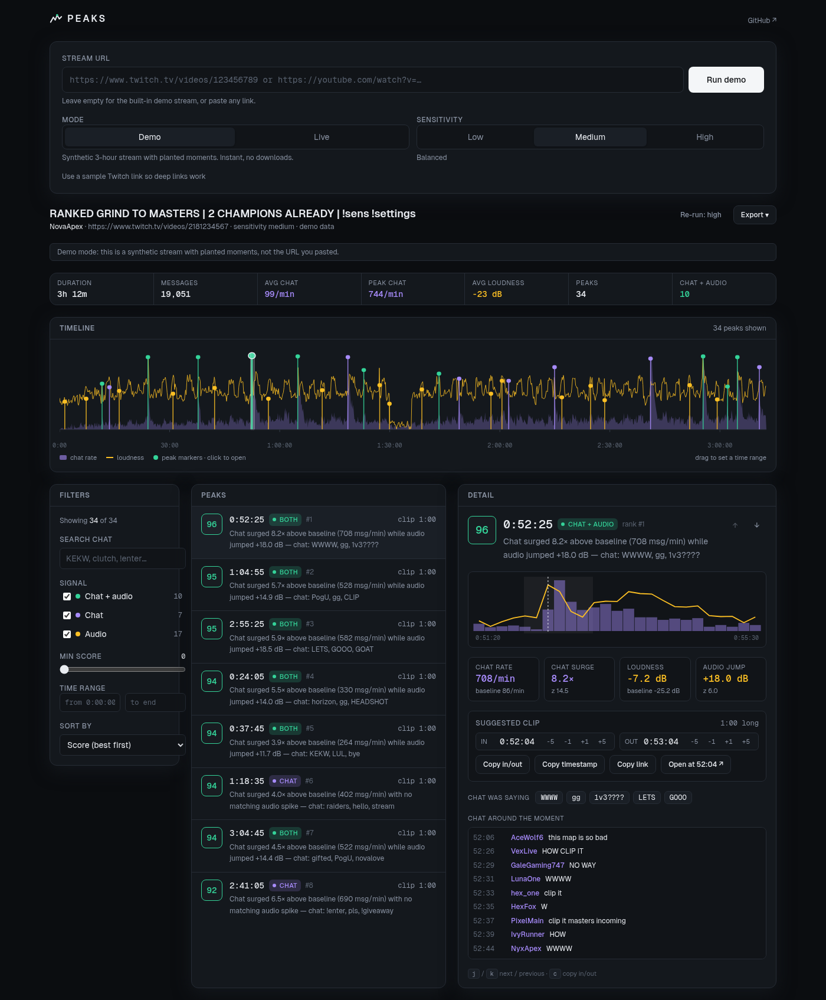

# PEAKS

**Find the moments worth clipping in a five-hour stream.**

Paste a YouTube or Twitch VOD link. PEAKS reads the chat replay and the audio
track, finds where chat activity and loudness spike, and hands you a ranked
list of clip moments with suggested in/out points, chat context, deep links,
and CSV/JSON export.



## Quick start

```bash
npm install
npm run dev            # http://localhost:3000
```

Open the app, leave the URL empty and press **Run demo**. Demo mode analyses a
synthetic three-hour Apex Legends stream with planted moments (clutches, a
raid, a giveaway, a mic peak…) so the whole flow works with no downloads and
no API keys.

To analyse real VODs, install two tools and make sure they are on `PATH`:

- [`yt-dlp`](https://github.com/yt-dlp/yt-dlp) — metadata, audio track, YouTube chat replay
- [`ffmpeg`](https://ffmpeg.org/) — loudness measurement (EBU R128 meter)

Then switch the form to **Live** and paste a link. Twitch chat replay is
fetched directly from Twitch's GraphQL endpoint (no key required).

```bash
cp .env.example .env   # optional: paths, limits, cache location
npm run build && npm start
```

## What it does

1. **Fetch.** The chat replay is pulled from the platform and the audio track
   is downloaded once at the lowest usable quality. Both are cached under
   `.peaks-cache/` so re-running a URL with a different sensitivity is instant.
2. **Bin.** Both signals are bucketed into 10-second bins: chat as messages
   per minute, loudness as momentary LUFS from ffmpeg's `ebur128` filter
   (1-second resolution, averaged in the power domain so short bursts survive).
3. **Detect.**
   - *Chat* is compared with a rolling 10-minute median and scaled by the
     rolling MAD (a robust z-score). Bins under an absolute rate floor never
     count, so three messages in a dead chat don't register.
   - *Audio* is measured on 2-second slices against the level of the previous
     60 seconds, so a scream registers the moment it happens even if the
     stream's overall level drifts between menus, gameplay and breaks.
     Sustained level changes (a game starting) are filtered out; only
     transients count.
4. **Rank.** Spikes from both signals are clustered into moments (anything
   within 45 s merges), anchored at the *onset* of the reaction, and scored
   0–100. Moments where chat and audio react together get a synergy bonus and
   rank highest. Each peak carries a one-line explanation ("Chat surged 4.6×
   above baseline while audio jumped +12 dB — chat: CLUTCH, 1v3, HOW").

## Features

- **Landing page** + **app** (`/app`), English UI, dark theme, keyboard
  navigation (`j`/`k` next/previous, `c` copy in/out).
- **Demo / Live** modes and three sensitivity presets (low / medium / high).
- **Progress UI** with per-stage status (resolve → chat → audio → detect),
  cancel, and shareable job URLs (`/app?job=<id>`).
- **Timeline** of the whole stream: chat rate area, loudness line, one marker
  per peak. Click a marker to open it; drag to restrict the time range.
- **Filters**: signal (chat + audio / chat / audio), minimum score, time range,
  full-text search over chat, sort by score / time / chat / audio intensity.
- **Peak detail**: score, reason, chat rate vs baseline, loudness jump,
  sparkline of both signals, the chat messages around the moment, the most
  repeated words/emotes, adjustable in/out points, and a deep link that opens
  the VOD at the clip start (`?t=` for both platforms).
- **Export** the filtered list as CSV, JSON, or a plain-text list.

## API

| Method | Route | Purpose |
| --- | --- | --- |
| `POST` | `/api/analyze` | `{ url, mode: "demo" \| "live", sensitivity: "low" \| "medium" \| "high" }` → `{ jobId }` (202) |
| `GET` | `/api/analyze` | Server capabilities and recent jobs |
| `GET` | `/api/jobs/:id` | Job status, stage progress, warnings, and the result once done |
| `DELETE` | `/api/jobs/:id` | Cancel a running job |

Jobs live in memory for `PEAKS_JOB_TTL_MINUTES` (default 120). The result
contains the ranked `peaks`, summary `stats`, and the binned `series` used by
the timeline.

## Configuration

Everything is optional; see [`.env.example`](.env.example).

| Variable | Default | Meaning |
| --- | --- | --- |
| `PEAKS_ENABLE_LIVE` | `true` | Allow live analysis (set `false` for a demo-only deployment) |
| `PEAKS_YTDLP_PATH` / `PEAKS_FFMPEG_PATH` | `yt-dlp` / `ffmpeg` | Binary locations |
| `PEAKS_YTDLP_ARGS` | – | Extra yt-dlp flags (cookies, proxies, rate limits) |
| `PEAKS_CACHE_DIR` | `.peaks-cache` | Where signals and temporary audio go |
| `PEAKS_MAX_DURATION_HOURS` | `8` | Refuse longer streams |
| `PEAKS_TWITCH_CHAT_WORKERS` | `4` | Parallel chat-replay requests (1–8) |
| `PEAKS_TWITCH_CLIENT_ID` | web player id | Override if Twitch rotates it |
| `PEAKS_KEEP_AUDIO` | `false` | Keep downloaded audio after analysis |
| `PEAKS_JOB_TTL_MINUTES` | `120` | How long finished jobs stay available |

## Development

```bash
npm run dev         # Next.js dev server
npm test            # vitest (detector, fixture, URL parsing, providers, export, filters)
npm run typecheck   # tsc --noEmit
npm run lint        # next lint
npm run build       # production build
```

Layout:

```
src/lib/analysis/   binning, robust z-scores, onset detection, spike clustering, ranking
src/lib/demo/       deterministic demo stream generator with planted events
src/lib/providers/  yt-dlp, ffmpeg loudness, YouTube chat replay, Twitch chat GraphQL
src/lib/jobs/       in-memory job store + runner (demo and live pipelines)
src/lib/url.ts      YouTube / Twitch / Kick URL parsing and deep links
src/lib/export.ts   CSV / JSON / text export
src/app/            landing page, /app, API routes
src/components/     form, progress, timeline, filters, peak list, detail, export
tests/              vitest suites
```

The demo fixture doubles as the detector's regression test: the planted
events must be recovered with the right signal attribution, the best moment
must be a chat + audio one, and high-scoring peaks must map to planted events.

## Supported URLs

- YouTube: `watch?v=`, `youtu.be/`, `/live/`, `/shorts/`, `/embed/` — finished
  live streams with chat replay work best; uploads without a chat replay are
  analysed on audio alone.
- Twitch: `twitch.tv/videos/<id>` (also legacy `/<channel>/v/<id>`). Channel
  and clip links are recognised but need a VOD link for analysis.
- Kick: recognised, not yet supported.

Timestamps in the pasted URL (`?t=1h2m3s`) are preserved in the parsed source.

## Known gaps

- Live (in-progress) streams are refused; analyse the VOD after the stream ends.
- Twitch chat uses the public GraphQL endpoint the web player uses. If Twitch
  rotates the client ID or the persisted query, set `PEAKS_TWITCH_CLIENT_ID`
  or update `src/lib/providers/twitchChat.ts`.
- Subscriber-only / members-only VODs need cookies (`PEAKS_YTDLP_ARGS`), and
  Twitch sub-only VODs are not supported for chat.
- Jobs and results are in-memory; a restart forgets them (signals stay cached
  on disk). A multi-instance deployment would need a shared store.
- Audio is judged by loudness only; laughter vs. rage vs. music all look the
  same. Chat is judged by volume only, not sentiment.
- No video preview in the app; deep links open the platform player instead.
